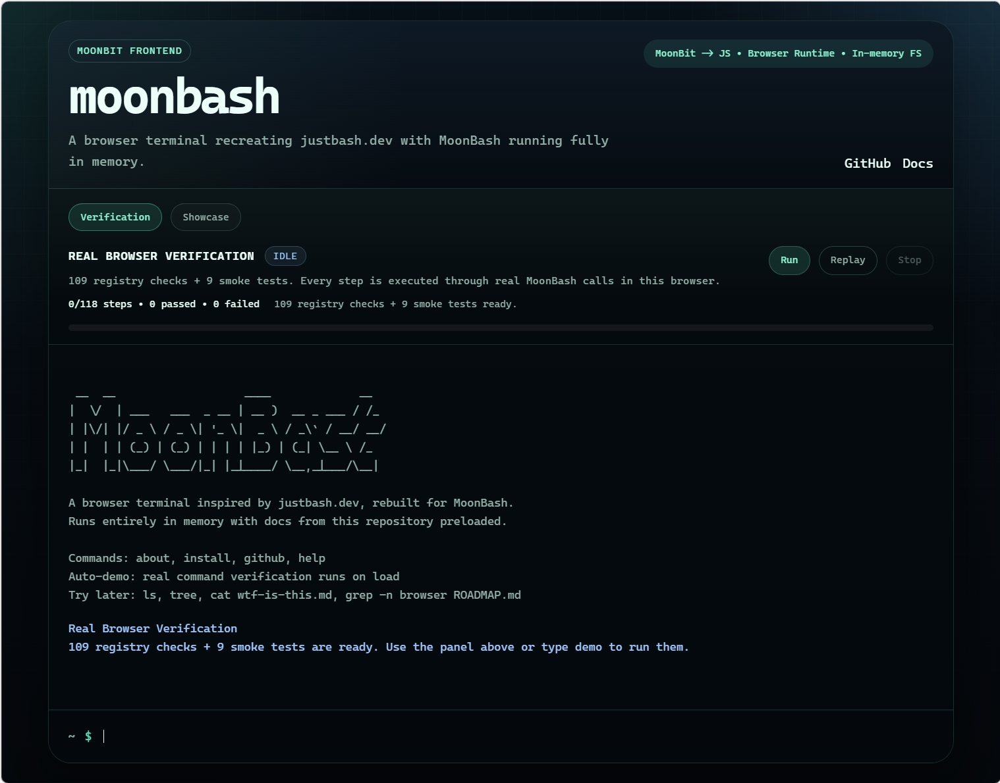

# MoonBash 开发心得体会

## 项目背景

MoonBash 是用 MoonBit 重写 Vercel 的 just-bash，编译成纯 JavaScript，零依赖，零 WASM，gzip 后 245KB，能在浏览器、Edge Functions、AI Agent 框架里跑一个纯内存的 POSIX Shell。命令从原来的 30 个扩到了 87 个，API 跟 just-bash 完全兼容。

这个项目的代码主要是用 Claude 和 Codex 写的——不是辅助了一下，是大部分 MoonBit 核心代码、TypeScript 包装、测试用例都是 AI 生成的。我的角色更多是架构决策、测试验收、问题定位，以及在多个 AI 之间来回协调。

所以这篇心得，除了讲 bug 和技术决策之外，我最想说的其实是：用 AI 开发一个有一定规模的项目，到底是怎么回事，核心卡点在哪里。

## 用 AI 开发的核心：先找到一套能用的测试基线

刚开始做这个项目的时候，我面临一个很现实的问题：让 AI 去写一个 Shell 解释器的实现代码，它确实能写，但你怎么知道它写得对不对？

Shell 的行为非常细碎。光一个变量展开的顺序，不同写法的结果就不一样。你不可能每写一个功能就自己手动跑一遍 Bash 去对比。如果没有一套自动化的验证机制，AI 写出来的代码你根本没法判断质量，只能一个个手动测，那还不如自己写。

所以我做的第一个关键决定，就是直接复用 just-bash 原有的测试用例作为基线。just-bash 本身有一套 comparison test，原理很简单：同一条命令，分别在真实 Bash 和虚拟 Shell 里跑一遍，对比 stdout、stderr 和退出码。这套测试有 500 多个用例，覆盖了变量、管道、重定向、循环、条件、字符串操作等等。

有了这套测试，开发流程就变成了：

1. 我告诉 AI 要实现哪个功能或哪个命令
2. AI 写出 MoonBit 代码
3. 跑 comparison test，看哪些过了哪些没过
4. 把失败的用例反馈给 AI，让它修
5. 循环，直到这组测试全绿

这个流程的好处是，AI 不需要理解整个 Shell 规范，它只需要让测试通过就行。测试基线替代了规范文档，成了 AI 实际参照的"标准答案"。这比你在 prompt 里贴一大段 POSIX 规范让 AI 去理解，效率高太多了。

## 但测试基线本身也有 bug

这个流程跑起来之后很快就撞到了一个问题：有些测试失败，不是 MoonBit 实现错了，而是测试基线本身就采错了。

最典型的就是 issue #4。parse-errors 这组测试里一整批用例报失败，for、if、while、until 相关的全挂了。一开始我让 AI 去查解释器的实现，它翻来覆去改了好几轮都不对。后来我自己介入，仔细看了一下发现，虚拟 Bash 的输出其实是对的，是真实 Bash 那边的基线退出码被污染了。

问题出在测试代码 tests/comparison/parse-errors.comparison.test.ts 里采集真实 Bash 返回值的逻辑：err.status || 1。这行代码在 status 为 0 的时候会把它当假值，硬改成 1。0 是合法退出码，被这么一改，基线就全偏了。

修复本身不复杂，改成 typeof err.status === "number" ? err.status : 1 就好了（提交 c52a6a4）。但找到这个问题花的时间远比修复多。因为在找到根因之前，我反复让 AI 去"修"解释器的实现，每一轮它都很认真地改了一些东西，测试结果却没有好转。这个过程非常消耗时间。

这件事给我的一个重要教训是：用 AI 开发时，测试基线的可信度是整个流程的根基。基线错了，AI 就会在错误的方向上一直努力，而且它自己完全意识不到。 发现并修复基线问题，是人必须做的事情，AI 代替不了。

## 交错使用多个 AI 的实际感受

这个项目里我交替用了 Claude 和 Codex，不是为了对比谁更厉害，而是实际需要。

Claude 适合做交互式的、需要理解上下文的工作：讨论架构方案、调试一个具体的 bug、理解一段 MoonBit 报错信息。Codex 更适合批量任务：一次性生成多个命令的实现框架、批量补测试用例、做大范围重构。

但这里面有一个很大的实际问题：上下文太长了，AI 会迷失。

87 个命令、500 多个测试用例、解释器的 AST 定义、文件系统实现——这些东西全部堆在一起，任何一个 AI 的上下文窗口都装不下。一开始我会在一个很长的对话里连续让 Claude 做事，但做到后面就会发现它开始"忘记"前面定过的接口，或者重复修一个已经修过的问题，甚至改着改着把之前已经通过的测试又改挂了。它不知道自己干到哪了。

后来我摸索出的办法是：

1. 分段切上下文。 一个对话只聚焦一个模块或一组命令，做完就开新对话。把之前的结论以文档或注释的形式固化下来，不要指望 AI 记住。
2. 用测试结果做"断点恢复"。 每轮开新对话，先把当前的测试通过率贴给 AI 看——"现在 comparison 是 520/523，这三个失败的是这些"。这样 AI 能快速定位到当前状态，不需要理解整个项目历史。
3. Claude 和 Codex 交替用。 当一个 AI 在某个问题上绕圈的时候，换一个 AI 从新视角看，经常能更快找到问题。不是因为另一个更聪明，而是它没有前面那些错误尝试的"包袱"，不会沿着同一条死胡同继续走。

这个协调工作说实话挺累的，比我预想的要费时间。你以为 AI 写代码很快，但实际上你花在"让 AI 知道现在该干什么"和"判断 AI 的输出到底对不对"上的时间，可能比 AI 实际写代码的时间还长。

## 一个关键技术决策：MoonBit 巨核 + TypeScript 薄壳

项目里最关键的架构决定，是把几乎所有核心逻辑都收进 MoonBit，TypeScript 只做 API 兼容层。

备选方案有三个：

1. TypeScript 写核心。 上手快，但 Shell 解释器做深之后 AST 类型嵌套很复杂，TS 的类型系统不够用，而且 JS 正则有 ReDoS 风险。
2. Rust + WASM。 类型系统强，但跨 WASM/JS 边界传字符串开销大，WASM 产物没法 minify，很难控制包体积。
3. MoonBit 编译到纯 JS。 代数数据类型写 AST 天然合适，产物是纯 JS，minify + gzip 能压到 245KB。

选 MoonBit 还有一个很实际的原因：它的编译器能帮 AI 兜底。 AI 生成的代码有时候会漏掉枚举分支、类型签名对不上，但 moon check 会直接报错。在 AI 大量生成代码的场景下，有一个严格的编译器卡在中间，比纯靠人 review 靠谱得多。TypeScript 的话，很多类似错误只有运行时才会暴露，87 个命令的代码量，人根本看不过来。

## MoonBit 工具链的帮助

moon check --target js 速度快，改完立刻能跑，是 AI 写代码 → 编译检查 → 反馈修改这个循环能快速转起来的前提。

moon build --target js 让核心直接出 JS 产物，外层 TS 和浏览器 demo 都能接上，不用维护两套逻辑。

模式匹配的穷尽检查是这个项目里的刚需。87 个命令、大量 AST 节点类型，每次加新东西忘了处理某个分支，编译器直接拦下来。这个特性在"AI 写代码、编译器把关"的工作流里价值特别大。

## 总结

这个项目做下来，我觉得用 AI 开发的核心不是"AI 能不能写代码"——能写，而且写得不慢。真正的核心是两件事：

第一，你要有一套靠谱的测试基线。 没有测试基线，AI 写出来的东西你没法验证，整个流程就转不起来。找到 just-bash 的 comparison test 并复用它，是这个项目能推进下去的根本原因。

第二，人的精力要花在 AI 做不了的事情上。 判断测试基线本身对不对、在多个 AI 之间协调上下文、在 AI 绕圈的时候及时换方向——这些事情现阶段只有人能做。AI 的问题不是写不出代码，而是它不知道自己干到哪了，不知道当前的测试失败到底是实现的问题还是基线的问题。把这些判断交给 AI，它会在错误方向上一直跑，反而浪费更多时间。

一个人加上两个 AI 再加上一个严格的编译器，确实能推动一个以前需要小团队才能做的项目。但这个"一个人"要做的事情，比以前不是更少了，而是换了一种——从"写代码"变成了"管 AI"。这个管理本身也是一种技能，得在实际项目里慢慢摸索。
